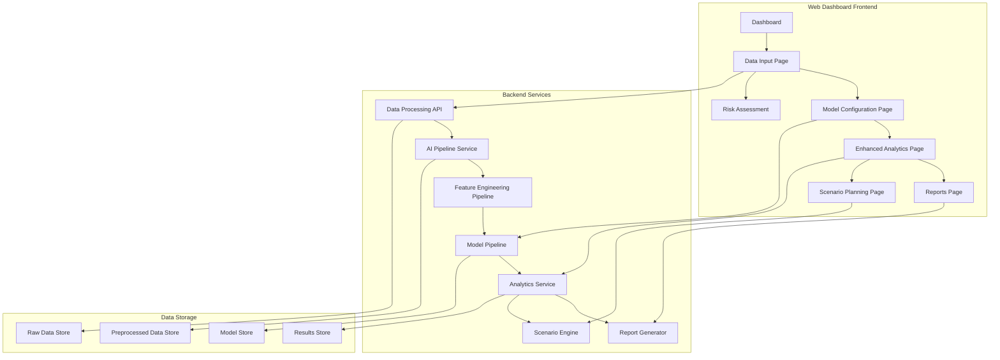

# Design Document

## Overview

The Data Science Workflow feature creates a comprehensive end-to-end machine learning pipeline within the PRISM web dashboard. This system enables users to input data, preprocess it through the AI pipeline, configure and train ML models, visualize results, generate reports, and perform scenario planning. The design integrates seamlessly with the existing dashboard architecture while adding four new pages and extensive backend processing capabilities.

## Architecture

### High-Level Architecture



### Component Integration

The workflow integrates with existing components:
- **DashboardLayout**: Extended navigation to include new pages
- **FeatureEngineeringPipeline**: Used for data preprocessing
- **ModelPipeline**: Enhanced for user-configurable training
- **Analytics components**: Extended for comprehensive visualizations
- **Report system**: New PDF generation capabilities

## Components and Interfaces

### 1. Data Input and Processing Page

#### Frontend Components

**DataInputPage.tsx**
```typescript
interface DataInputPageProps {
  onDataProcessed: (processedData: ProcessedDataset) => void;
}

interface TableData {
  headers: string[];
  rows: (string | number)[][];
  metadata: {
    rowCount: number;
    columnCount: number;
    dataTypes: { [column: string]: 'string' | 'number' | 'date' };
  };
}
```

**Key Components:**
- `ManualTableEditor`: Spreadsheet-like interface for manual data entry
- `CSVDropZone`: Drag-and-drop area with file validation
- `DataPreview`: Paginated table view with column type detection
- `PreprocessingStatus`: Real-time status indicator with progress bar

#### Backend API Endpoints

```typescript
// Data upload and validation
POST /api/data/upload
Content-Type: multipart/form-data
Response: { dataId: string, preview: TableData, validation: ValidationResult }

// Manual data submission
POST /api/data/manual
Body: { tableData: TableData, metadata: DatasetMetadata }
Response: { dataId: string, validation: ValidationResult }

// Trigger preprocessing
POST /api/data/{dataId}/preprocess
Body: { preprocessingConfig: PreprocessingConfig }
Response: { jobId: string, estimatedDuration: number }

// Check preprocessing status
GET /api/data/preprocess/{jobId}/status
Response: { status: 'pending' | 'processing' | 'completed' | 'failed', progress: number, result?: ProcessedDataset }
```

### 2. Model Configuration and Training Page

#### Frontend Components

**ModelConfigurationPage.tsx**
```typescript
interface ModelConfigurationPageProps {
  preprocessedData: ProcessedDataset;
  onTrainingComplete: (results: TrainingResults) => void;
}

interface ModelConfiguration {
  modelType: 'random_forest' | 'xgboost' | 'neural_network' | 'ensemble';
  hyperparameters: { [key: string]: any };
  trainingConfig: {
    trainTestSplit: number;
    validationStrategy: 'holdout' | 'k_fold' | 'stratified';
    crossValidationFolds?: number;
  };
  optimizationConfig: {
    useAutoOptimization: boolean;
    optimizationMethod?: 'grid_search' | 'random_search' | 'bayesian';
    parameterRanges?: { [key: string]: any[] };
  };
}
```

**Key Components:**
- `ModelSelector`: Cards showing available model types with descriptions
- `HyperparameterTuner`: Dynamic form based on selected model
- `TrainingSplitVisualizer`: Interactive pie chart for data split configuration
- `OptimizationSettings`: Toggle between manual and automated hyperparameter tuning
- `TrainingProgress`: Real-time training metrics and progress visualization

#### Backend Integration

```typescript
// Start model training
POST /api/models/train
Body: { dataId: string, configuration: ModelConfiguration }
Response: { trainingJobId: string, estimatedDuration: number }

// Get training progress
GET /api/models/train/{trainingJobId}/progress
Response: { 
  status: 'queued' | 'training' | 'validating' | 'completed' | 'failed',
  progress: number,
  currentMetrics?: TrainingMetrics,
  logs: string[]
}

// Get training results
GET /api/models/train/{trainingJobId}/results
Response: TrainingResults
```

### 3. Enhanced Analytics Page

#### Frontend Components

**AnalyticsPage.tsx**
```typescript
interface AnalyticsPageProps {
  trainingResults: TrainingResults[];
  onExportData: (format: 'csv' | 'json' | 'excel') => void;
}

interface AnalyticsData {
  modelPerformance: ModelMetrics[];
  featureImportance: FeatureImportanceData;
  dataDistributions: DistributionData;
  predictionAnalysis: PredictionAnalysisData;
  comparisonMetrics: ModelComparisonData;
}
```

**Key Components:**
- `ModelPerformanceCharts`: ROC curves, confusion matrices, learning curves
- `FeatureImportanceVisualizer`: Interactive bar charts and SHAP plots
- `DataDistributionPlots`: Histograms, box plots, correlation matrices
- `PredictionAnalysisPanel`: Residual plots, prediction vs actual scatter plots
- `ModelComparisonDashboard`: Side-by-side model performance comparison
- `InteractiveFilters`: Time range, model type, and metric filters

#### Visualization Library Integration

Using **Plotly.js** for interactive charts:
- Real-time updates without page refresh
- Zoom, pan, and drill-down capabilities
- Export functionality (PNG, SVG, PDF)
- Responsive design for mobile devices

### 4. Reports Page

#### Frontend Components

**ReportsPage.tsx**
```typescript
interface ReportsPageProps {
  analyticsData: AnalyticsData;
  trainingHistory: TrainingResults[];
}

interface ReportConfiguration {
  sections: ReportSection[];
  format: 'pdf' | 'html' | 'docx';
  includeCharts: boolean;
  includeRawData: boolean;
  customSections?: CustomSection[];
}
```

**Key Components:**
- `ReportPreview`: Live preview of report content
- `SectionEditor`: Drag-and-drop interface for customizing report sections
- `ExportControls`: Format selection and download options
- `ReportHistory`: Version management and previous report access
- `TemplateManager`: Predefined report templates for different use cases

#### PDF Generation Service

```typescript
// Generate report
POST /api/reports/generate
Body: { 
  analyticsData: AnalyticsData,
  configuration: ReportConfiguration,
  metadata: ReportMetadata
}
Response: { reportId: string, estimatedGenerationTime: number }

// Check generation status
GET /api/reports/{reportId}/status
Response: { 
  status: 'generating' | 'completed' | 'failed',
  progress: number,
  downloadUrl?: string
}

// Download report
GET /api/reports/{reportId}/download
Response: Binary file (PDF/HTML/DOCX)
```

### 5. Scenario Planning Page

#### Frontend Components

**ScenarioPage.tsx**
```typescript
interface ScenarioPageProps {
  trainedModels: TrainedModel[];
  analyticsData: AnalyticsData;
}

interface Scenario {
  id: string;
  name: string;
  description: string;
  parameters: { [key: string]: any };
  conditions: ScenarioCondition[];
  results?: ScenarioResults;
}

interface ScenarioCondition {
  parameter: string;
  operator: 'equals' | 'greater_than' | 'less_than' | 'between';
  value: any;
  weight?: number;
}
```

**Key Components:**
- `ScenarioBuilder`: Form interface for creating new scenarios
- `ParameterSliders`: Interactive controls for adjusting input parameters
- `ScenarioComparison`: Side-by-side comparison of multiple scenarios
- `RiskHeatmap`: Geographical visualization of risk under different conditions
- `ScenarioResults`: Charts showing predicted outcomes and confidence intervals
- `ScenarioLibrary`: Save, load, and organize scenario configurations

## Data Models

### Core Data Structures

```typescript
interface ProcessedDataset {
  id: string;
  originalData: RawDataset;
  features: number[][];
  labels: number[];
  featureNames: string[];
  preprocessing: {
    steps: PreprocessingStep[];
    statistics: DataStatistics;
    qualityScore: number;
  };
  metadata: {
    createdAt: Date;
    processedAt: Date;
    rowCount: number;
    featureCount: number;
  };
}

interface TrainingResults {
  id: string;
  modelId: string;
  configuration: ModelConfiguration;
  metrics: {
    training: ModelMetrics;
    validation: CrossValidationResult;
    test: ModelMetrics;
  };
  featureImportance?: { [feature: string]: number };
  trainingTime: number;
  artifacts: {
    modelPath: string;
    configPath: string;
    metricsPath: string;
  };
}

interface ScenarioResults {
  scenarioId: string;
  predictions: PredictionResult[];
  riskAssessment: RiskAssessment;
  confidence: number;
  sensitivity: SensitivityAnalysis;
  recommendations: string[];
}
```

### Database Schema

**PostgreSQL Tables:**
```sql
-- Datasets table
CREATE TABLE datasets (
  id UUID PRIMARY KEY,
  name VARCHAR(255) NOT NULL,
  description TEXT,
  raw_data JSONB NOT NULL,
  processed_data JSONB,
  preprocessing_config JSONB,
  created_at TIMESTAMP DEFAULT NOW(),
  updated_at TIMESTAMP DEFAULT NOW()
);

-- Models table
CREATE TABLE trained_models (
  id UUID PRIMARY KEY,
  dataset_id UUID REFERENCES datasets(id),
  model_type VARCHAR(50) NOT NULL,
  configuration JSONB NOT NULL,
  metrics JSONB NOT NULL,
  feature_importance JSONB,
  model_path VARCHAR(500),
  created_at TIMESTAMP DEFAULT NOW()
);

-- Scenarios table
CREATE TABLE scenarios (
  id UUID PRIMARY KEY,
  name VARCHAR(255) NOT NULL,
  description TEXT,
  model_id UUID REFERENCES trained_models(id),
  parameters JSONB NOT NULL,
  results JSONB,
  created_at TIMESTAMP DEFAULT NOW()
);

-- Reports table
CREATE TABLE reports (
  id UUID PRIMARY KEY,
  title VARCHAR(255) NOT NULL,
  content JSONB NOT NULL,
  format VARCHAR(20) NOT NULL,
  file_path VARCHAR(500),
  created_at TIMESTAMP DEFAULT NOW()
);
```

## Error Handling

### Frontend Error Handling

```typescript
interface ErrorBoundaryState {
  hasError: boolean;
  error?: Error;
  errorInfo?: ErrorInfo;
}

// Global error handling for async operations
const handleAsyncError = (error: Error, context: string) => {
  console.error(`Error in ${context}:`, error);
  
  // Show user-friendly error message
  showNotification({
    type: 'error',
    title: 'Operation Failed',
    message: getErrorMessage(error),
    duration: 5000
  });
  
  // Log to monitoring service
  logError(error, context);
};

// Specific error types
class DataValidationError extends Error {
  constructor(public validationErrors: ValidationError[]) {
    super('Data validation failed');
  }
}

class ModelTrainingError extends Error {
  constructor(public trainingLogs: string[]) {
    super('Model training failed');
  }
}
```

### Backend Error Handling

```typescript
// API error responses
interface APIError {
  code: string;
  message: string;
  details?: any;
  timestamp: string;
}

// Error middleware
const errorHandler = (error: Error, req: Request, res: Response, next: NextFunction) => {
  const apiError: APIError = {
    code: error.name || 'INTERNAL_ERROR',
    message: error.message || 'An unexpected error occurred',
    timestamp: new Date().toISOString()
  };
  
  if (error instanceof DataValidationError) {
    apiError.details = error.validationErrors;
    return res.status(400).json(apiError);
  }
  
  if (error instanceof ModelTrainingError) {
    apiError.details = { logs: error.trainingLogs };
    return res.status(422).json(apiError);
  }
  
  // Log error for monitoring
  logger.error('API Error:', error);
  
  res.status(500).json(apiError);
};
```

## Testing Strategy

### Unit Testing

**Frontend Tests (Jest + React Testing Library):**
```typescript
// Component testing
describe('DataInputPage', () => {
  test('should handle CSV file upload', async () => {
    const mockFile = new File(['col1,col2\n1,2\n3,4'], 'test.csv', { type: 'text/csv' });
    const { getByTestId } = render(<DataInputPage />);
    
    const dropzone = getByTestId('csv-dropzone');
    fireEvent.drop(dropzone, { dataTransfer: { files: [mockFile] } });
    
    await waitFor(() => {
      expect(getByTestId('data-preview')).toBeInTheDocument();
    });
  });
  
  test('should validate data before preprocessing', async () => {
    const invalidData = { headers: ['col1'], rows: [['invalid']] };
    const { getByTestId } = render(<DataInputPage />);
    
    // Test validation logic
    expect(validateTableData(invalidData)).toHaveProperty('errors');
  });
});
```

**Backend Tests (Jest + Supertest):**
```typescript
describe('Data Processing API', () => {
  test('POST /api/data/upload should process CSV file', async () => {
    const response = await request(app)
      .post('/api/data/upload')
      .attach('file', 'test/fixtures/sample.csv')
      .expect(200);
    
    expect(response.body).toHaveProperty('dataId');
    expect(response.body.preview).toHaveProperty('headers');
  });
  
  test('should handle preprocessing errors gracefully', async () => {
    const response = await request(app)
      .post('/api/data/invalid-id/preprocess')
      .send({ preprocessingConfig: {} })
      .expect(404);
    
    expect(response.body.code).toBe('DATASET_NOT_FOUND');
  });
});
```

### Integration Testing

```typescript
describe('End-to-End Workflow', () => {
  test('complete data science workflow', async () => {
    // 1. Upload data
    const uploadResponse = await uploadTestData();
    const dataId = uploadResponse.body.dataId;
    
    // 2. Preprocess data
    const preprocessResponse = await preprocessData(dataId);
    await waitForPreprocessing(preprocessResponse.body.jobId);
    
    // 3. Train model
    const trainingResponse = await trainModel(dataId, testModelConfig);
    await waitForTraining(trainingResponse.body.trainingJobId);
    
    // 4. Generate analytics
    const analyticsResponse = await getAnalytics(trainingResponse.body.modelId);
    expect(analyticsResponse.body).toHaveProperty('modelPerformance');
    
    // 5. Create scenario
    const scenarioResponse = await createScenario(trainingResponse.body.modelId, testScenario);
    expect(scenarioResponse.body).toHaveProperty('results');
  });
});
```

### Performance Testing

```typescript
describe('Performance Tests', () => {
  test('should handle large datasets efficiently', async () => {
    const largeDataset = generateTestDataset(10000); // 10k rows
    const startTime = Date.now();
    
    const response = await processDataset(largeDataset);
    const processingTime = Date.now() - startTime;
    
    expect(processingTime).toBeLessThan(30000); // 30 seconds max
    expect(response.body.qualityScore).toBeGreaterThan(0.8);
  });
  
  test('should support concurrent model training', async () => {
    const trainingPromises = Array.from({ length: 3 }, (_, i) => 
      trainModel(testDataId, { ...testModelConfig, modelType: `test_${i}` })
    );
    
    const results = await Promise.all(trainingPromises);
    results.forEach(result => {
      expect(result.status).toBe(200);
    });
  });
});
```

## Security Considerations

### Data Protection
- **File Upload Validation**: Strict file type and size limits
- **Data Sanitization**: Clean user input before processing
- **Access Control**: User-specific data isolation
- **Encryption**: Encrypt sensitive data at rest and in transit

### API Security
- **Authentication**: JWT tokens for API access
- **Rate Limiting**: Prevent abuse of computationally expensive operations
- **Input Validation**: Comprehensive validation of all API inputs
- **CORS Configuration**: Restrict cross-origin requests appropriately

### Model Security
- **Model Isolation**: Separate model execution environments
- **Resource Limits**: Prevent resource exhaustion attacks
- **Audit Logging**: Track all model training and prediction activities