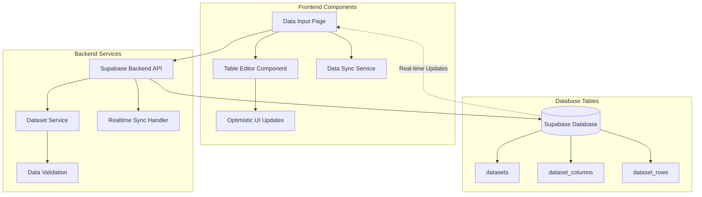

# Design Document

## Overview

This design implements real-time database table synchronization between the web dashboard's Data Input page and Supabase database tables. The system provides a seamless table editor experience where UI changes are immediately persisted to the database, and the interface always reflects the current database state.

## Architecture

### High-Level Architecture



### Data Flow

1. **User Action**: User performs CRUD operation in table editor
2. **Optimistic Update**: UI immediately reflects the change
3. **API Call**: Change is sent to Supabase backend
4. **Database Update**: Backend updates corresponding database tables
5. **Confirmation/Rollback**: UI receives success/error response
6. **Real-time Sync**: Other clients receive updates via Supabase realtime

## Components and Interfaces

### Frontend Components

#### TableSyncService
```typescript
interface TableSyncService {
  // Core CRUD operations
  addRow(tableId: string, rowData: Record<string, any>): Promise<void>;
  updateCell(tableId: string, rowId: string, columnId: string, value: any): Promise<void>;
  deleteRows(tableId: string, rowIds: string[]): Promise<void>;
  
  // Schema operations
  addColumn(tableId: string, column: ColumnDefinition): Promise<void>;
  updateColumn(tableId: string, columnId: string, updates: Partial<ColumnDefinition>): Promise<void>;
  deleteColumn(tableId: string, columnId: string): Promise<void>;
  
  // Data loading
  loadTableData(tableId: string): Promise<TableData>;
  
  // Real-time subscriptions
  subscribeToTable(tableId: string, callback: (change: TableChange) => void): () => void;
}
```

#### OptimisticUpdateManager
```typescript
interface OptimisticUpdateManager {
  // Queue operations for optimistic updates
  queueOperation(operation: TableOperation): string; // returns operation ID
  
  // Confirm or rollback operations
  confirmOperation(operationId: string): void;
  rollbackOperation(operationId: string): void;
  
  // Get pending operations
  getPendingOperations(): TableOperation[];
}
```

#### Enhanced DataInputPage
- Integrates with TableSyncService for all table operations
- Implements optimistic UI updates with rollback capability
- Shows real-time indicators for pending operations
- Handles conflict resolution for concurrent edits

### Backend API Enhancements

#### Real-time Table Operations API
```typescript
// New endpoints for granular table operations
POST   /api/datasets/:id/rows                    // Add single row
PUT    /api/datasets/:id/rows/:rowId             // Update single row
DELETE /api/datasets/:id/rows/:rowId             // Delete single row
PUT    /api/datasets/:id/rows/:rowId/cells/:columnId  // Update single cell

POST   /api/datasets/:id/columns                 // Add column
PUT    /api/datasets/:id/columns/:columnId       // Update column
DELETE /api/datasets/:id/columns/:columnId       // Delete column

GET    /api/datasets/:id/sync                    // Get current sync state
POST   /api/datasets/:id/sync/subscribe          // Subscribe to changes
```

#### Enhanced DatasetService
```typescript
interface EnhancedDatasetService {
  // Granular row operations
  addRow(datasetId: string, rowData: Record<string, any>): Promise<DatasetRow>;
  updateRow(datasetId: string, rowId: string, updates: Record<string, any>): Promise<DatasetRow>;
  deleteRow(datasetId: string, rowId: string): Promise<void>;
  updateCell(datasetId: string, rowId: string, columnId: string, value: any): Promise<void>;
  
  // Real-time operations
  broadcastChange(datasetId: string, change: TableChange): Promise<void>;
  getTableState(datasetId: string): Promise<TableState>;
}
```

## Data Models

### Enhanced Database Schema

The existing Supabase schema already supports the required functionality:

```sql
-- datasets table (existing)
CREATE TABLE datasets (
  id UUID PRIMARY KEY DEFAULT gen_random_uuid(),
  name TEXT NOT NULL,
  description TEXT,
  row_count INTEGER NOT NULL DEFAULT 0,
  column_count INTEGER NOT NULL DEFAULT 0,
  status TEXT NOT NULL DEFAULT 'ready',
  created_at TIMESTAMPTZ DEFAULT NOW(),
  updated_at TIMESTAMPTZ DEFAULT NOW()
);

-- dataset_columns table (existing)
CREATE TABLE dataset_columns (
  id UUID PRIMARY KEY DEFAULT gen_random_uuid(),
  dataset_id UUID REFERENCES datasets(id) ON DELETE CASCADE,
  name TEXT NOT NULL,
  display_name TEXT NOT NULL,
  data_type TEXT NOT NULL CHECK (data_type IN ('text', 'number', 'date', 'boolean')),
  is_required BOOLEAN DEFAULT FALSE,
  validation_rules JSONB,
  order_index INTEGER NOT NULL,
  created_at TIMESTAMPTZ DEFAULT NOW(),
  updated_at TIMESTAMPTZ DEFAULT NOW()
);

-- dataset_rows table (existing)
CREATE TABLE dataset_rows (
  id UUID PRIMARY KEY DEFAULT gen_random_uuid(),
  dataset_id UUID REFERENCES datasets(id) ON DELETE CASCADE,
  row_index INTEGER NOT NULL,
  data JSONB NOT NULL,
  created_at TIMESTAMPTZ DEFAULT NOW(),
  updated_at TIMESTAMPTZ DEFAULT NOW()
);
```

### Frontend Data Models

```typescript
interface TableData {
  id: string;
  name: string;
  columns: ColumnDefinition[];
  rows: RowData[];
  metadata: {
    totalRows: number;
    totalColumns: number;
    lastUpdated: Date;
  };
}

interface ColumnDefinition {
  id: string;
  name: string;
  displayName: string;
  dataType: 'text' | 'number' | 'date' | 'boolean';
  isRequired: boolean;
  validationRules?: ValidationRules;
  orderIndex: number;
}

interface RowData {
  id: string;
  rowIndex: number;
  data: Record<string, any>;
  isNew?: boolean;
  isModified?: boolean;
  isPending?: boolean;
}

interface TableOperation {
  id: string;
  type: 'add_row' | 'update_cell' | 'delete_row' | 'add_column' | 'update_column' | 'delete_column';
  tableId: string;
  payload: any;
  timestamp: Date;
  status: 'pending' | 'confirmed' | 'failed';
}

interface TableChange {
  type: 'row_added' | 'row_updated' | 'row_deleted' | 'column_added' | 'column_updated' | 'column_deleted';
  tableId: string;
  data: any;
  timestamp: Date;
  userId?: string;
}
```

## Error Handling

### Error Types and Recovery Strategies

1. **Network Connectivity Issues**
   - Queue operations locally
   - Retry with exponential backoff
   - Show offline indicator
   - Sync when connection restored

2. **Validation Errors**
   - Immediate UI feedback
   - Highlight problematic fields
   - Prevent invalid data submission
   - Show detailed error messages

3. **Concurrent Edit Conflicts**
   - Detect conflicts using timestamps
   - Show conflict resolution dialog
   - Allow user to choose resolution strategy
   - Merge changes when possible

4. **Database Constraint Violations**
   - Rollback optimistic updates
   - Show specific constraint error
   - Suggest corrective actions
   - Prevent similar future errors

### Error Handling Implementation

```typescript
interface ErrorHandler {
  handleNetworkError(operation: TableOperation): Promise<void>;
  handleValidationError(error: ValidationError, operation: TableOperation): void;
  handleConflictError(conflict: ConflictError): Promise<ConflictResolution>;
  handleConstraintError(error: ConstraintError, operation: TableOperation): void;
}

interface ConflictResolution {
  strategy: 'keep_local' | 'keep_remote' | 'merge' | 'manual';
  mergedData?: any;
}
```

## Testing Strategy

### Unit Tests
- TableSyncService operations
- OptimisticUpdateManager functionality
- Error handling scenarios
- Data validation logic

### Integration Tests
- Frontend-backend API communication
- Database CRUD operations
- Real-time synchronization
- Conflict resolution workflows

### End-to-End Tests
- Complete user workflows
- Multi-user concurrent editing
- Network failure scenarios
- Data persistence across page refreshes

### Performance Tests
- Large dataset handling
- Real-time update latency
- Memory usage optimization
- Database query performance

## Implementation Phases

### Phase 1: Core Synchronization
- Implement basic CRUD operations with database sync
- Add optimistic UI updates
- Basic error handling and rollback

### Phase 2: Real-time Features
- Implement Supabase real-time subscriptions
- Add conflict detection and resolution
- Multi-user editing indicators

### Phase 3: Advanced Features
- Offline support with operation queuing
- Advanced validation and constraints
- Performance optimizations

### Phase 4: Polish and Testing
- Comprehensive error handling
- User experience improvements
- Performance testing and optimization