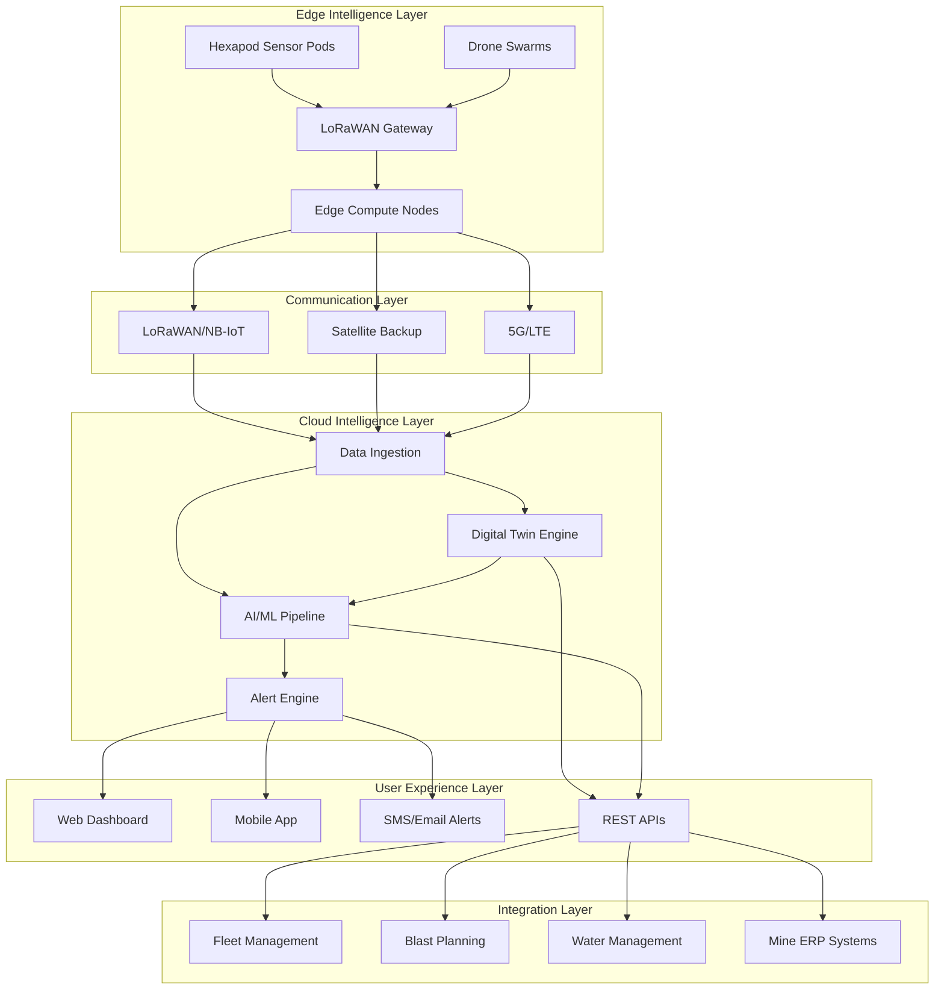

# PRISM - Predictive Rockfall Intelligence & Safety Management
## Design Document

## Overview

PRISM is architected as a cloud-native, AI-first platform that combines edge intelligence, digital twin technology, and advanced machine learning to create a comprehensive rockfall prediction and safety management ecosystem. The system employs a three-tier architecture: Edge Intelligence Layer (hexapod sensors + local processing), Cloud Intelligence Layer (AI/ML models + digital twin), and User Experience Layer (dashboards + mobile apps + alerts).

The design leverages cutting-edge research in spatio-temporal deep learning, physics-informed neural networks, and autonomous systems to deliver not just predictions but prescriptive intelligence that guides operational decision-making. The architecture is designed for horizontal scalability, supporting deployment across multiple mine sites with federated learning capabilities.

## Architecture

### System Architecture Overview




### Edge Intelligence Architecture

The edge layer implements a distributed intelligence network where each hexapod sensor pod acts as an autonomous data collection and processing node:

**Hexapod Sensor Pod Design:**
- **Primary Configuration**: ESP32-based controller with LoRa module for cost-effective deployment
- **Advanced Configuration**: Raspberry Pi 4 + Coral Edge TPU for local AI inference
- **Mobile Configuration**: Six-legged autonomous robot with NVIDIA Jetson Orin for cliff-face inspection

**Edge Processing Pipeline:**
1. **Data Collection**: Multi-sensor fusion (tilt, accelerometer, piezometer, temperature, humidity, strain/FBG)
2. **Local Preprocessing**: Signal filtering, anomaly detection, data compression
3. **Edge Inference**: Lightweight ML models for immediate threat detection
4. **Communication**: Adaptive transmission based on risk levels and network conditions

### Cloud Intelligence Architecture

The cloud layer implements a microservices architecture using Kubernetes for orchestration:

**Core Services:**
- **Data Ingestion Service**: Handles multi-protocol data streams (MQTT, HTTP, LoRaWAN)
- **Digital Twin Service**: Maintains real-time virtual representation of mine environment
- **AI/ML Pipeline Service**: Orchestrates model training, inference, and deployment
- **Alert Management Service**: Processes risk assessments and generates notifications
- **User Management Service**: Handles authentication, authorization, and multi-tenancy

**Data Architecture:**
- **Time-Series Database**: InfluxDB/TimescaleDB for sensor data
- **Spatial Database**: PostGIS for geospatial data and DEM storage
- **Object Storage**: S3-compatible storage for imagery, models, and large datasets
- **Graph Database**: Neo4j for modeling spatial relationships and sensor networks
- **Message Queue**: Apache Kafka for real-time data streaming

## Components and Interfaces

### 1. Multi-Source Data Integration Engine

**Component Purpose**: Unified data ingestion and preprocessing for all monitoring data sources

**Key Interfaces:**
- **DEM Processing API**: Handles UAV photogrammetry, LiDAR, and satellite DEM data
- **Imagery Analysis API**: Processes RGB, multispectral, and thermal drone imagery
- **Sensor Data API**: Real-time ingestion of geotechnical sensor streams
- **Environmental Data API**: Weather station and climate data integration
- **InSAR Integration API**: Satellite-based displacement measurement processing

**Technical Implementation:**
```python
class DataIntegrationEngine:
    def __init__(self):
        self.dem_processor = DEMProcessor()
        self.image_analyzer = ImageAnalyzer()
        self.sensor_handler = SensorDataHandler()
        self.insar_processor = InSARProcessor()
    
    async def process_multi_source_data(self, data_batch):
        # Parallel processing of different data types
        tasks = [
            self.dem_processor.process(data_batch.dem_data),
            self.image_analyzer.analyze(data_batch.imagery),
            self.sensor_handler.ingest(data_batch.sensor_data),
            self.insar_processor.process(data_batch.insar_data)
        ]
        results = await asyncio.gather(*tasks)
        return self.fuse_data_sources(results)
```

### 2. Advanced AI/ML Prediction Engine

**Component Purpose**: Multi-model ensemble for rockfall risk prediction with explainable AI

**Model Architecture:**

**Graph Neural Network (GNN) Component:**
- Models spatial relationships between slope segments and sensor nodes
- Uses Graph Attention Networks (GAT) for dynamic attention weighting
- Incorporates geological connectivity and hydrological flow patterns

**Spatio-Temporal Deep Learning Component:**
- Diffusion Convolutional Recurrent Neural Network (DCRNN) for displacement forecasting
- Graph WaveNet (GWNet) for multi-scale temporal pattern recognition
- Temporal Graph Networks for long-term trend analysis

**Physics-Informed Neural Network (PINN) Component:**
- Integrates slope stability equations (limit equilibrium, finite element)
- Incorporates Darcy flow equations for groundwater modeling
- Enforces conservation laws and physical constraints

**Technical Implementation:**
```python
class HybridPredictionEngine:
    def __init__(self):
        self.gnn_model = GraphAttentionNetwork()
        self.temporal_model = DCRNN()
        self.pinn_model = PhysicsInformedNN()
        self.ensemble_weights = BayesianEnsemble()
    
    def predict_rockfall_risk(self, spatial_graph, temporal_data, physics_params):
        # Multi-model prediction
        gnn_pred = self.gnn_model(spatial_graph)
        temporal_pred = self.temporal_model(temporal_data)
        physics_pred = self.pinn_model(physics_params)
        
        # Bayesian ensemble with uncertainty quantification
        ensemble_pred = self.ensemble_weights.combine([
            gnn_pred, temporal_pred, physics_pred
        ])
        
        return {
            'risk_probability': ensemble_pred.mean,
            'confidence_interval': ensemble_pred.std,
            'time_to_failure': self.estimate_ttf(ensemble_pred),
            'explanation': self.generate_explanation(ensemble_pred)
        }
```

### 3. Digital Twin Engine

**Component Purpose**: Real-time virtual representation with bidirectional IoT communication

**Core Components:**
- **Geometric Model**: 3D mesh representation of mine geometry with real-time updates
- **Sensor Network Model**: Virtual representation of all deployed sensors
- **Physics Simulation Engine**: Finite element modeling for stress analysis
- **State Synchronization**: Real-time sync between physical and virtual states

**Technical Implementation:**
```python
class DigitalTwinEngine:
    def __init__(self):
        self.geometric_model = Mine3DModel()
        self.sensor_network = VirtualSensorNetwork()
        self.physics_engine = FEMSimulator()
        self.state_manager = StateManager()
    
    def update_twin_state(self, sensor_data, geometry_updates):
        # Update geometric model
        if geometry_updates:
            self.geometric_model.update_mesh(geometry_updates)
        
        # Sync sensor states
        self.sensor_network.update_states(sensor_data)
        
        # Run physics simulation
        stress_field = self.physics_engine.compute_stress(
            self.geometric_model.mesh,
            self.sensor_network.get_boundary_conditions()
        )
        
        # Update digital twin state
        self.state_manager.sync_state({
            'geometry': self.geometric_model.state,
            'sensors': self.sensor_network.state,
            'physics': stress_field
        })
        
        return self.state_manager.get_current_state()
```

### 4. Hexapod Hardware Platform

**Component Purpose**: Autonomous data collection with edge intelligence capabilities

**Hardware Specifications:**

**Standard Sensor Pod Configuration:**
- **Controller**: ESP32-S3 with dual-core processor
- **Sensors**: 6-axis IMU, 3-axis tiltmeter, piezometer, temperature/humidity, strain gauge input
- **Communication**: LoRa 868/915MHz with 15km range
- **Power**: Solar panel + LiFePO4 battery (30-day autonomy)
- **Housing**: IP67 rated, -40°C to +70°C operating range

**Advanced Mobile Configuration:**
- **Compute**: NVIDIA Jetson Orin Nano for edge AI
- **Locomotion**: Six-legged design with servo actuators
- **Sensors**: Stereo camera, thermal imaging, micro-LiDAR, ultrasonic
- **Navigation**: RTK GNSS, IMU, visual-inertial odometry
- **Communication**: 5G/LTE + LoRaWAN backup

**Software Architecture:**
```python
class HexapodController:
    def __init__(self, config):
        self.sensor_manager = SensorManager(config.sensors)
        self.edge_ai = EdgeInferenceEngine()
        self.communication = CommunicationManager()
        self.power_manager = PowerManager()
    
    async def autonomous_monitoring_loop(self):
        while True:
            # Collect sensor data
            sensor_data = await self.sensor_manager.read_all()
            
            # Local anomaly detection
            anomaly_score = self.edge_ai.detect_anomaly(sensor_data)
            
            # Adaptive transmission based on risk
            if anomaly_score > self.threshold:
                await self.communication.send_priority(sensor_data)
            else:
                await self.communication.send_batch(sensor_data)
            
            # Power management
            sleep_duration = self.power_manager.calculate_sleep_time()
            await asyncio.sleep(sleep_duration)
```

### 5. Intelligent Alert and Action System

**Component Purpose**: Risk-based alerting with prescriptive action recommendations

**Alert Classification System:**
- **Level 1 (Low)**: Probability 10-25%, Monitor closely
- **Level 2 (Medium)**: Probability 25-50%, Restrict access
- **Level 3 (High)**: Probability 50-75%, Evacuate personnel
- **Level 4 (Critical)**: Probability >75%, Stop all operations

**Prescriptive Action Engine:**
```python
class PrescriptiveActionEngine:
    def __init__(self):
        self.action_templates = ActionTemplateLibrary()
        self.cost_benefit_analyzer = CostBenefitAnalyzer()
        self.fleet_integration = FleetManagementAPI()
    
    def generate_action_plan(self, risk_assessment):
        # Determine appropriate actions based on risk level
        base_actions = self.action_templates.get_actions(
            risk_level=risk_assessment.level,
            affected_area=risk_assessment.spatial_extent
        )
        
        # Cost-benefit optimization
        optimized_actions = self.cost_benefit_analyzer.optimize(
            actions=base_actions,
            operational_cost=risk_assessment.operational_impact,
            safety_risk=risk_assessment.safety_impact
        )
        
        # Generate specific recommendations
        return {
            'immediate_actions': optimized_actions.immediate,
            'preventive_measures': optimized_actions.preventive,
            'monitoring_adjustments': optimized_actions.monitoring,
            'estimated_cost': optimized_actions.total_cost,
            'risk_reduction': optimized_actions.risk_reduction
        }
```

## Data Models

### Core Data Structures

**Spatial Data Model:**
```python
@dataclass
class SpatialLocation:
    latitude: float
    longitude: float
    elevation: float
    utm_x: float
    utm_y: float
    mine_grid_x: float
    mine_grid_y: float

@dataclass
class SlopeSegment:
    id: str
    geometry: Polygon
    slope_angle: float
    aspect: float
    curvature: float
    rock_type: str
    joint_orientation: List[float]
    stability_rating: float
```

**Sensor Data Model:**
```python
@dataclass
class SensorReading:
    sensor_id: str
    timestamp: datetime
    location: SpatialLocation
    measurements: Dict[str, float]
    quality_flags: Dict[str, bool]
    battery_level: float
    signal_strength: float

@dataclass
class HexapodStatus:
    pod_id: str
    location: SpatialLocation
    operational_status: str
    sensor_health: Dict[str, str]
    last_communication: datetime
    power_status: PowerStatus
```

**Risk Assessment Model:**
```python
@dataclass
class RiskAssessment:
    assessment_id: str
    timestamp: datetime
    spatial_extent: Polygon
    risk_probability: float
    confidence_interval: Tuple[float, float]
    time_to_failure: Optional[float]
    contributing_factors: List[str]
    alert_level: int
    recommended_actions: List[str]
    explanation: str
```

**Digital Twin State Model:**
```python
@dataclass
class DigitalTwinState:
    twin_id: str
    last_updated: datetime
    geometric_model: GeometricModel
    sensor_network_state: Dict[str, SensorState]
    physics_simulation_results: PhysicsResults
    environmental_conditions: EnvironmentalState
    operational_parameters: OperationalState
```

## Error Handling

### Comprehensive Error Management Strategy

**1. Data Quality and Validation:**
```python
class DataQualityManager:
    def validate_sensor_data(self, data: SensorReading) -> ValidationResult:
        checks = [
            self.check_range_validity(data),
            self.check_temporal_consistency(data),
            self.check_spatial_consistency(data),
            self.check_sensor_health(data)
        ]
        return ValidationResult(checks)
    
    def handle_data_anomalies(self, anomaly: DataAnomaly):
        if anomaly.severity == 'critical':
            self.alert_operators(anomaly)
            self.switch_to_backup_sensors(anomaly.sensor_id)
        elif anomaly.severity == 'warning':
            self.log_anomaly(anomaly)
            self.adjust_confidence_weights(anomaly.sensor_id)
```

**2. Communication Failure Handling:**
```python
class CommunicationFailureHandler:
    def handle_network_partition(self, affected_nodes: List[str]):
        # Enable local edge processing
        for node in affected_nodes:
            self.enable_autonomous_mode(node)
        
        # Activate backup communication channels
        self.activate_satellite_backup()
        
        # Adjust prediction models for missing data
        self.update_model_weights(missing_sensors=affected_nodes)
    
    def handle_data_sync_on_reconnection(self, node_id: str, buffered_data: List[SensorReading]):
        # Validate buffered data
        validated_data = self.validate_buffered_data(buffered_data)
        
        # Backfill digital twin state
        self.digital_twin.backfill_state(validated_data)
        
        # Retrain models if significant data gap
        if self.is_significant_gap(buffered_data):
            self.trigger_model_retraining()
```

**3. Model Performance Degradation:**
```python
class ModelHealthMonitor:
    def monitor_prediction_accuracy(self):
        current_performance = self.evaluate_recent_predictions()
        
        if current_performance.accuracy < self.performance_threshold:
            self.trigger_model_retraining()
            self.switch_to_backup_model()
            self.alert_ml_engineers()
    
    def handle_concept_drift(self, drift_detection_result):
        if drift_detection_result.drift_magnitude > self.drift_threshold:
            # Gradual model adaptation
            self.initiate_online_learning()
            
            # Update feature importance weights
            self.update_feature_weights(drift_detection_result.affected_features)
```

**4. Hardware Failure Management:**
```python
class HardwareFailureManager:
    def handle_sensor_failure(self, sensor_id: str, failure_type: str):
        # Immediate response
        self.mark_sensor_offline(sensor_id)
        self.adjust_spatial_interpolation(sensor_id)
        
        # Redundancy activation
        nearby_sensors = self.find_nearby_sensors(sensor_id)
        self.increase_sampling_rate(nearby_sensors)
        
        # Maintenance scheduling
        self.schedule_maintenance(sensor_id, failure_type)
    
    def handle_hexapod_failure(self, hexapod_id: str):
        # Emergency protocols
        if self.is_in_hazardous_area(hexapod_id):
            self.trigger_emergency_retrieval()
        
        # Data recovery
        self.attempt_remote_data_extraction(hexapod_id)
        
        # Coverage adjustment
        self.redistribute_monitoring_coverage(hexapod_id)
```

## Testing Strategy

### Multi-Level Testing Approach

**1. Unit Testing:**
- **AI/ML Model Testing**: Cross-validation, holdout testing, synthetic data validation
- **Sensor Integration Testing**: Hardware-in-the-loop testing with simulated environments
- **API Testing**: Comprehensive REST API testing with automated test suites
- **Digital Twin Testing**: Physics simulation validation against known benchmarks

**2. Integration Testing:**
- **End-to-End Data Flow**: From sensor to prediction to alert generation
- **Multi-System Integration**: Fleet management, blast planning, water management systems
- **Communication Protocol Testing**: LoRaWAN, satellite, cellular network testing
- **Failover Testing**: Network partition, hardware failure, power loss scenarios

**3. Performance Testing:**
- **Load Testing**: 10,000+ concurrent sensor readings, 100+ dashboard users
- **Stress Testing**: Peak data volumes during storm events or blasting operations
- **Latency Testing**: Real-time prediction response times under various loads
- **Scalability Testing**: Multi-mine deployment with federated learning

**4. Field Testing and Validation:**
```python
class FieldTestingFramework:
    def design_controlled_experiments(self):
        return {
            'synthetic_rockfall_tests': self.setup_controlled_rockfall(),
            'blast_induced_monitoring': self.monitor_blast_effects(),
            'weather_event_tracking': self.track_storm_impacts(),
            'long_term_stability_monitoring': self.setup_baseline_monitoring()
        }
    
    def validate_prediction_accuracy(self, test_results):
        metrics = {
            'precision_at_k': self.calculate_precision_at_k(test_results),
            'lead_time_analysis': self.analyze_lead_times(test_results),
            'false_alarm_rate': self.calculate_false_alarms(test_results),
            'spatial_accuracy': self.measure_spatial_accuracy(test_results)
        }
        return metrics
```

**5. Safety and Reliability Testing:**
- **Fail-Safe Testing**: Ensure system fails to safe state under all conditions
- **Redundancy Testing**: Validate backup systems and graceful degradation
- **Security Testing**: Penetration testing, encryption validation, access control
- **Regulatory Compliance Testing**: Alignment with mining safety regulations

**6. User Acceptance Testing:**
- **Dashboard Usability**: Mine operators, safety engineers, management interfaces
- **Mobile App Testing**: Field technician workflows, emergency response procedures
- **Alert System Testing**: SMS/email delivery, escalation procedures, acknowledgment workflows
- **Training Effectiveness**: VR/AR training module validation with actual personnel

This comprehensive design provides the technical foundation for implementing PRISM as a world-class rockfall prediction and safety management system that incorporates the latest research advances while maintaining practical deployability and operational excellence.