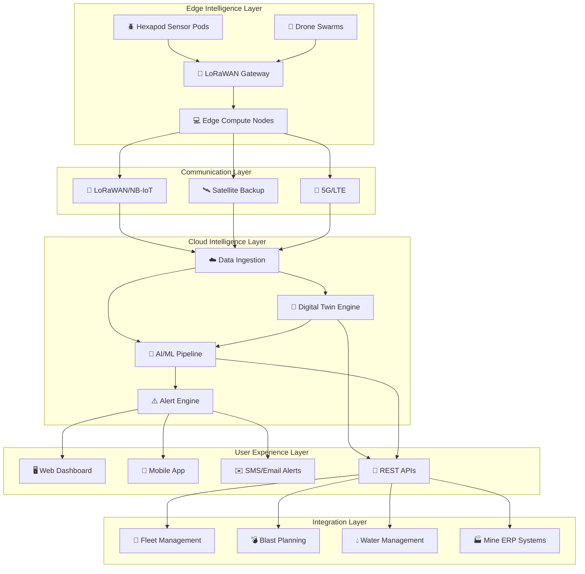

```mermaid
%%{init: {'theme': 'default'}}%%
graph TB
    subgraph "Edge Intelligence Layer"
        H[🪲 Hexapod Sensor Pods]
        D[🚁 Drone Swarms]
        G[📡 LoRaWAN Gateway]
        E[💻 Edge Compute Nodes]
        H --> G
        D --> G
        G --> E
    end
    
    subgraph "Communication Layer"
        L[📶 LoRaWAN/NB-IoT]
        S[🛰️ Satellite Backup]
        F[📱 5G/LTE]
        E --> L
        E --> S
        E --> F
    end
    
    subgraph "Cloud Intelligence Layer"
        I[☁️ Data Ingestion]
        DT[🧩 Digital Twin Engine]
        AI[🤖 AI/ML Pipeline]
        A[⚠️ Alert Engine]
        L --> I
        S --> I
        F --> I
        I --> DT
        I --> AI
        AI --> A
        DT --> AI
    end
    
    subgraph "User Experience Layer"
        W[🖥️ Web Dashboard]
        M[📱 Mobile App]
        SMS[✉️ SMS/Email Alerts]
        API[🔗 REST APIs]
        A --> W
        A --> M
        A --> SMS
        DT --> API
        AI --> API
    end
    
    subgraph "Integration Layer"
        FM[🚚 Fleet Management]
        BP[💣 Blast Planning]
        WM[💧 Water Management]
        ERP[🏭 Mine ERP Systems]
        API --> FM
        API --> BP
        API --> WM
        API --> ERP
    end
```
