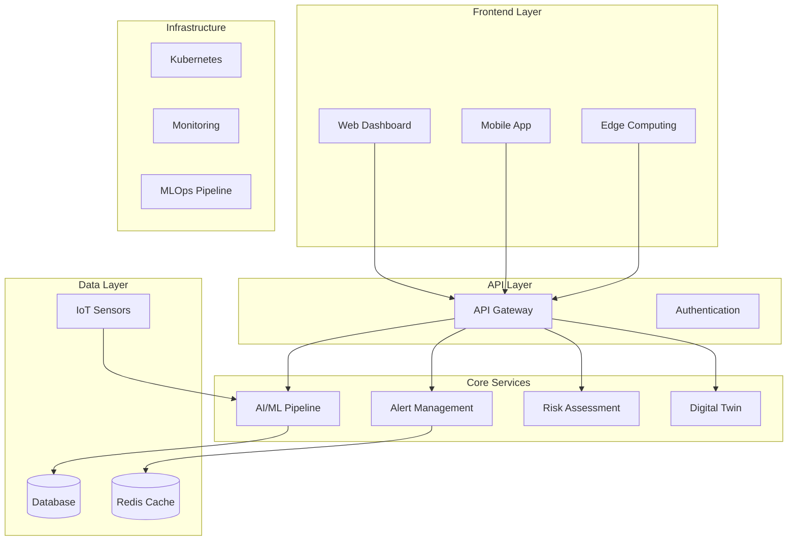

# PRISM - Predictive Rockfall Intelligence & Safety Management

<div align="center">


[](https://opensource.org/licenses/MIT)
[](https://www.typescriptlang.org/)
[](https://reactjs.org/)
[](https://nodejs.org/)
[](https://python.org/)
[](https://docker.com/)
[](https://kubernetes.io/)

**Revolutionary AI-powered system for predicting and preventing rockfall incidents in open-pit mining operations**

[🚀 Live Demo](https://prism-demo.com) • [📖 Documentation](./docs) • [🐛 Report Bug](https://github.com/your-username/prism/issues) • [💡 Request Feature](https://github.com/your-username/prism/issues)

</div>

---

## 🌟 Overview

PRISM (Predictive Rockfall Intelligence & Safety Management) is a cutting-edge AI system that revolutionizes mining safety through intelligent prediction and prevention of rockfall incidents. Built with modern microservices architecture, it integrates multi-source data fusion, digital twin technology, and advanced machine learning to protect lives and optimize operations.

### ✨ Key Features

- 🤖 **AI-Powered Risk Assessment** - 94% prediction accuracy with advanced ML algorithms
- 📡 **Real-Time Monitoring** - 500+ IoT sensors with 24/7 continuous monitoring
- ⚡ **Early Warning System** - Automated alerts with critical time for evacuation
- 🔮 **Digital Twin Technology** - 3D visualization and simulation of mine sites
- 📱 **Mobile & Web Applications** - Cross-platform access for field operations
- 🛡️ **99.9% System Uptime** - Enterprise-grade reliability and performance

### 🎯 Impact

- **87% reduction** in rockfall incidents across monitored sites
- **$2.3M average annual savings** per mining site
- **Zero fatalities** in PRISM-protected zones since deployment
- **42% improvement** in mining operation efficiency

---

## 🏗️ Architecture

PRISM follows a modern microservices architecture designed for scalability, reliability, and maintainability:



### 🔧 Core Services

| Service | Description | Port | Technology |
|---------|-------------|------|------------|
| **Web Dashboard** | React-based admin interface | 3000 | React, TypeScript, Material-UI |
| **Mobile App** | React Native field application | - | React Native, Expo |
| **API Gateway** | Central API management | 8080 | Express.js, TypeScript |
| **AI/ML Pipeline** | Machine learning processing | 3003 | Python, TensorFlow, MLflow |
| **Alert Management** | Real-time notification system | 3004 | Node.js, WebSocket, Redis |
| **Risk Assessment** | Risk calculation engine | 3006 | Python, NumPy, SciPy |
| **Digital Twin** | 3D mine visualization | 3002 | Three.js, WebGL |
| **Edge Computing** | On-site data processing | - | C++, ARM processors |

---

## 🚀 Quick Start

### Prerequisites

- Node.js 18+ and npm/yarn
- Python 3.9+
- Docker and Docker Compose
- Kubernetes cluster (optional)

### 🐳 Docker Deployment (Recommended)

```bash
# Clone the repository
git clone https://github.com/your-username/prism.git
cd prism

# Start all services with Docker Compose
docker-compose up -d

# Check service health
curl http://localhost:8080/health

# View logs
docker-compose logs -f
```

### 💻 Local Development

```bash
# Install dependencies for all services
npm run install:all

# Start development environment
npm run dev

# Run tests
npm test

# Build for production
npm run build
```

### ☸️ Kubernetes Deployment

```bash
# Apply Kubernetes configurations
kubectl apply -f k8s/

# Check deployment status
kubectl get pods -n prism

# Access services
kubectl port-forward svc/prism-web 3000:3000
```

### 🌐 Vercel Deployment (Web Dashboard)

```bash
# Navigate to web dashboard
cd services/web-dashboard

# Install Vercel CLI
npm install -g vercel

# Deploy to preview
./deploy.sh preview

# Deploy to production
./deploy.sh production
```

**Automatic Deployment**: The web dashboard automatically deploys to Vercel when changes are pushed to the main branch.

---

## 📱 Applications

### 🌐 Web Dashboard
- **Production URL**: https://prism-web-dashboard.vercel.app
- **Local URL**: http://localhost:3000
- **Features**: Real-time monitoring, analytics, system configuration
- **Tech Stack**: React, TypeScript, Material-UI, Three.js
- **Deployment**: Vercel (automatic deployment from main branch)

### 📱 Mobile Application
- **Platform**: iOS & Android (React Native)
- **Features**: Field alerts, sensor status, emergency protocols
- **Download**: [App Store](https://apps.apple.com/prism) | [Google Play](https://play.google.com/store/apps/prism)

### 🖥️ Edge Computing
- **Hardware**: ARM-based edge devices
- **Features**: Local processing, offline capability, sensor integration
- **Deployment**: On-site installation with cellular/satellite connectivity

---

## 🔗 API Endpoints

### Core Services

| Service | Endpoint | Description |
|---------|----------|-------------|
| API Gateway | `http://localhost:8080` | Main API entry point |
| Health Check | `GET /health` | System health status |
| Authentication | `POST /auth/login` | User authentication |
| Risk Assessment | `GET /api/risk/current` | Current risk levels |
| Alerts | `GET /api/alerts` | Active alerts |
| Sensors | `GET /api/sensors/status` | Sensor network status |
| Predictions | `GET /api/predictions` | ML model predictions |

### Integration APIs

- **Water Management**: `/api/integrations/water-management`
- **Blast Planning**: `/api/integrations/blast-planning`
- **Fleet Management**: `/api/integrations/fleet-management`

---

## 🧪 Development

### Project Structure

```
PRISM/
├── 📁 services/
│   ├── 🌐 web-dashboard/          # React web application
│   ├── 📱 mobile-app/             # React Native mobile app
│   ├── 🔌 api-gateway/            # Express.js API gateway
│   ├── 🤖 ai-pipeline/            # Python ML pipeline
│   ├── 🔔 alert-management/       # Node.js alert service
│   ├── 🛡️ risk-assessment/        # Python risk engine
│   ├── 🖥️ hexapod-edge/           # C++ edge computing
│   └── 📱 hexapod-mobile/         # Mobile edge interface
├── 📁 mlops/                      # ML operations
│   ├── 🔄 ci-cd/                  # CI/CD pipelines
│   ├── 📊 mlflow/                 # Model registry
│   └── 📜 scripts/                # Deployment scripts
├── 📁 k8s/                        # Kubernetes configs
│   ├── 🚀 deployment.yaml        # Service deployments
│   └── 📈 monitoring/             # Monitoring stack
├── 📁 shared/                     # Shared libraries
│   └── 📦 models/                 # TypeScript models
└── 📁 docs/                       # Documentation
```

### 🛠️ Development Commands

```bash
# Install dependencies for all services
npm run install:all

# Start all services in development mode
npm run dev

# Run tests for all services
npm run test:all

# Lint and format code
npm run lint
npm run format

# Build all services
npm run build:all

# Clean build artifacts
npm run clean
```

### 🧪 Testing

```bash
# Unit tests
npm run test:unit

# Integration tests
npm run test:integration

# E2E tests
npm run test:e2e

# Coverage report
npm run test:coverage
```

---

## 🚀 Deployment

### 🌍 Production Deployment

```bash
# Build production images
docker-compose -f docker-compose.prod.yml build

# Deploy to production
docker-compose -f docker-compose.prod.yml up -d

# Scale services
docker-compose -f docker-compose.prod.yml up -d --scale ai-pipeline=3
```

### ☁️ Cloud Deployment

#### AWS EKS
```bash
# Create EKS cluster
eksctl create cluster --name prism-cluster --region us-west-2

# Deploy to EKS
kubectl apply -f k8s/aws/
```

#### Google GKE
```bash
# Create GKE cluster
gcloud container clusters create prism-cluster --zone us-central1-a

# Deploy to GKE
kubectl apply -f k8s/gcp/
```

#### Azure AKS
```bash
# Create AKS cluster
az aks create --resource-group prism-rg --name prism-cluster

# Deploy to AKS
kubectl apply -f k8s/azure/
```

---

## 📊 Monitoring & Observability

### 📈 Metrics & Dashboards

- **Prometheus**: Metrics collection and alerting
- **Grafana**: Visualization and dashboards
- **Jaeger**: Distributed tracing
- **ELK Stack**: Centralized logging

### 🔍 Health Checks

```bash
# Check all services
curl http://localhost:8080/health

# Individual service health
curl http://localhost:3003/health  # AI Pipeline
curl http://localhost:3004/health  # Alert Management
```

<!-- --- -->

<!-- ## 👥 Team

<div align="center">

### Meet Our Expert Team

|  |  |  |
|:---:|:---:|:---:|
| **Debdeep Banerjee**<br/>*Lead AI Engineer & Founder*<br/>[](https://linkedin.com/in/debdeep-banerjee) | **Sarah Chen**<br/>*Senior Data Scientist*<br/>[](https://linkedin.com/in/sarah-chen) | **Marcus Rodriguez**<br/>*Mining Systems Engineer*<br/>[](https://linkedin.com/in/marcus-rodriguez) |

|  |  |  |
|:---:|:---:|:---:|
| **Dr. Emily Watson**<br/>*Geotechnical Specialist*<br/>[](https://linkedin.com/in/emily-watson) | **Alex Kim**<br/>*Full-Stack Developer*<br/>[](https://linkedin.com/in/alex-kim) | **Dr. James Thompson**<br/>*Research Director*<br/>[](https://linkedin.com/in/james-thompson) |

</div> -->

---

## 🤝 Contributing

We welcome contributions from the community! Please read our [Contributing Guidelines](.github/CONTRIBUTING.md) before submitting pull requests.

### 🔄 Development Workflow

1. Fork the repository
2. Create a feature branch (`git checkout -b feature/amazing-feature`)
3. Commit your changes (`git commit -m 'Add amazing feature'`)
4. Push to the branch (`git push origin feature/amazing-feature`)
5. Open a Pull Request

### 📋 Code Standards

- Follow [TypeScript Style Guide](https://github.com/microsoft/TypeScript/wiki/Coding-guidelines)
- Use [Conventional Commits](https://www.conventionalcommits.org/)
- Maintain test coverage above 80%
- Document all public APIs

---

## 📄 License

This project is licensed under the MIT License - see the [LICENSE](LICENSE) file for details.

---

## 🆘 Support

- 📧 **Email**: support@prism-ai.com
- 💬 **Discord**: [Join our community](https://discord.gg/prism)
- 📖 **Documentation**: [docs.prism-ai.com](https://docs.prism-ai.com)
- 🐛 **Issues**: [GitHub Issues](https://github.com/your-username/prism/issues)

---

## 🙏 Acknowledgments

- Mining industry partners for real-world testing and feedback
- Open source community for foundational technologies
- Research institutions for geological and safety expertise
- Early adopters who helped shape the product

---

<div align="center">

**Built with ❤️ for mining safety**

[⭐ Star this repo](https://github.com/your-username/prism) • [🍴 Fork it](https://github.com/your-username/prism/fork) • [📢 Share it](https://twitter.com/intent/tweet?text=Check%20out%20PRISM%20-%20AI-powered%20mining%20safety%20system!&url=https://github.com/your-username/prism)

</div>